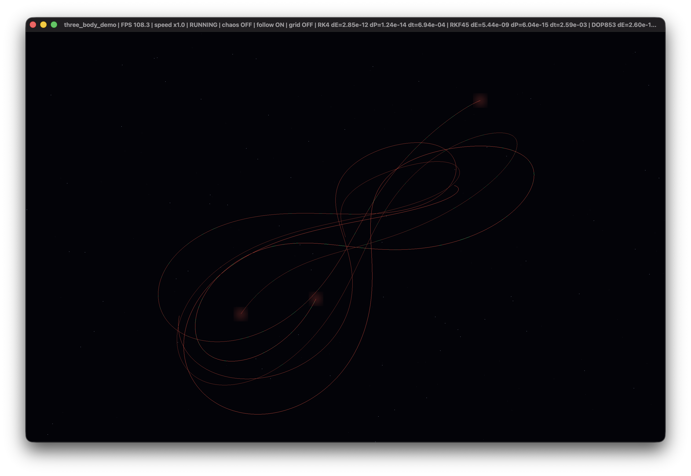
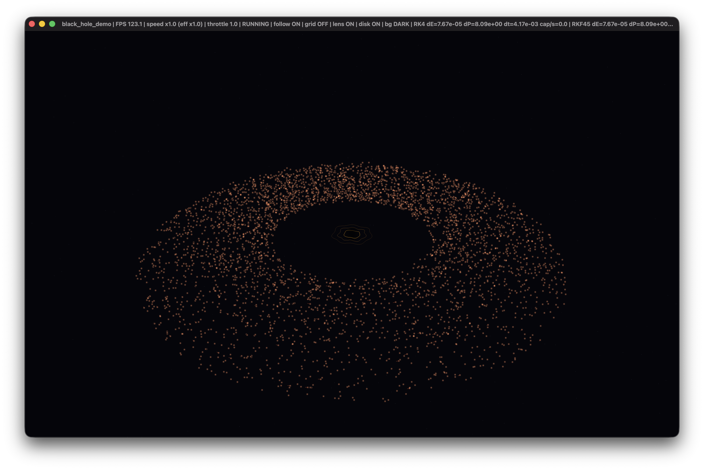
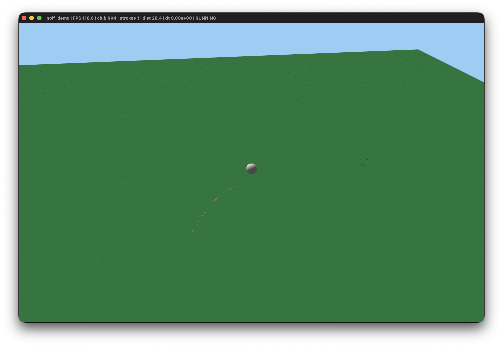

# Tableau

Header-only C++17 library implementing explicit Runge-Kutta methods for numerical integration of ordinary differential equations.


## Overview

This library provides three explicit Runge-Kutta integrators covering the spectrum from fixed-step classical methods to high-order adaptive schemes with dense output. The implementations are intended for production simulation code where predictable numerical behavior, explicit step control, and low integration overhead are required.

The two lower-order solvers (RK4 and RKF45) are original implementations written from scratch. The DOP853 integrator is a direct, line-by-line port of the original Fortran code by E. Hairer and G. Wanner, reinterpreted in modern C++. The numerical core, coefficient tables, and step-control logic faithfully reproduce the original algorithm as published in:

> E. Hairer, S.P. Norsett, G. Wanner, *Solving Ordinary Differential Equations I: Nonstiff Problems*, Springer Series in Computational Mathematics, 2nd edition, 1993.

The library is header-only and distributed as a CMake `INTERFACE` target. It imposes no constraints on state representation beyond basic algebraic operations (`+`, `-`, scalar `*`), allowing the same solver to operate on scalars, fixed-size vectors, or structured state containers.

## Methods

| Method   | Type     | Order  | Step control | Dense output | Description |
| -------- | -------- | ------ | ------------ | ------------ | ----------- |
| `RK4`    | Fixed    | 4      | None         | No           | Classical four-stage Runge-Kutta. Deterministic time stepping for reference baselines and systems where fixed step size is sufficient or required. |
| `RKF45`  | Adaptive | 4(5)   | Embedded     | No           | Runge-Kutta-Fehlberg with a 4th-order propagation and 5th-order error estimate. General-purpose adaptive integration with configurable absolute and relative tolerances. |
| `DOP853` | Adaptive | 8(5,3) | Embedded     | Yes          | Dormand-Prince 8th-order method with 5th- and 3rd-order embedded error estimates. Supports dense output interpolation, per-component tolerances, stiffness detection, and detailed execution statistics. Optimized execution path for `std::vector<double>`. |

## Numerical Model

Each solver advances a system defined by a first-order ODE:

```
dy/dt = f(y, t)
```

Execution follows a standard pipeline:

1. **State definition.** The user provides the state type and its arithmetic operations.
2. **Derivative evaluation.** A callable `f(y, t)` returns the time derivative for a given state and time.
3. **Step computation.** Fixed-step methods advance deterministically. Adaptive methods compute embedded error estimates and adjust the step size to satisfy prescribed tolerances.
4. **Acceptance logic.** Adaptive solvers accept or reject steps based on the ratio of estimated local truncation error to the tolerance threshold. Rejected steps are recomputed with a reduced step size.
5. **Dense output** (DOP853 only). Accepted steps optionally construct 7th-order interpolation polynomials for continuous solution evaluation between mesh points.
6. **Instrumentation.** Solvers expose execution statistics (`nfcn`, `nstep`, `naccpt`, `nrejct`), termination status, and optional callbacks for monitoring or external control.

## Quick Start

### Build

```bash
./build.sh
```

Options: `--debug`, `--clean`, `--verbose`, `--demos`, `--benchmarks`, `--no-tests`, `--build-dir <dir>`

### CMake Integration

```cmake
add_subdirectory(path/to/Tableau)
target_link_libraries(your_target PRIVATE tableau::core)
```

### Minimal Example

```cpp
#include "RKF45.h"

using namespace tableau::integration;

int main() {
    RKF45Integrator<double> solver;
    auto deriv = [](const double& y, double /*t*/) { return -y; };

    auto result = solver.adaptiveStep(
        1.0,   // y0
        0.0,   // t0
        0.1,   // initial dt
        1e-6,  // target error
        deriv
    );

    return result.success ? 0 : 1;
}
```

## DOP853 Interface

The DOP853 implementation exposes a full integration driver specialized for high-dimensional continuous systems represented as `std::vector<double>`. This interface is intended for long-running simulations, sensitivity analysis, and workloads requiring controlled numerical accuracy over extended time intervals.

Capabilities:

* Structured termination status (`DOP853Status`): convergence, stiffness detection, step-size underflow, and max-step limits.
* Execution statistics: function evaluations (`nfcn`), total steps (`nstep`), accepted steps (`naccpt`), rejected steps (`nrejct`).
* Scalar or per-component relative and absolute error tolerances.
* Dense output interpolation with optional sparse component evaluation.
* Step callback interface (`solout`) for logging, event detection, or early termination.

## Benchmarks

Measured with Google Benchmark on Apple M3 Pro, macOS, Apple Clang 17, `-O2`. Times correspond to full integration runs over the stated intervals.

| Problem                        |     RK4 |   RKF45 |  DOP853 | DOP853 vs RK4 |
| ------------------------------ | ------: | ------: | ------: | ------------: |
| Harmonic oscillator (1 period) |  492 us |  800 us |  3.3 us |          149x |
| Lorenz (`t = 10`)              | 9.25 ms | 1.46 ms |   73 us |          126x |
| Three-body (`t = 1`)           |  140 us |   19 us | 1.97 us |           71x |

The performance advantage of DOP853 stems from its high order: fewer derivative evaluations are needed to reach a given accuracy, which dominates wall-clock time for smooth systems.

```bash
cmake -S . -B build -DBUILD_BENCHMARKS=ON -DCMAKE_BUILD_TYPE=Release
cmake --build build --target tableau_benchmarks
./build/tableau_benchmarks
```

## Demonstration Programs

The following demos provide real-time visualization of the solvers applied to physical systems of varying complexity. Each demo runs all three integrators simultaneously and displays per-integrator diagnostics in the title bar, including energy drift (`dE`), momentum drift (`dP`), step size (`dt`), and integrator status. These are visualization tools only and are not part of the numerical core.

### Three-Body Problem



Real-time integration of a three-body gravitational system under Newtonian dynamics with equal masses. The trajectories shown are the orbital paths of three mutually gravitating bodies evolved from a figure-eight initial condition. The title bar reports per-integrator energy drift (`dE`) and momentum drift (`dP`) as conserved-quantity diagnostics, alongside the current adaptive step size (`dt`). Energy and momentum conservation serve as proxy indicators of numerical accuracy: lower drift implies tighter adherence to the underlying Hamiltonian structure of the system.

### Black Hole Accretion Disk



A cloud of ~5000 test particles orbiting a central Schwarzschild-like gravitational potential. Each particle is integrated independently under a pseudo-Newtonian force law with gravitational softening. Particles falling below the capture radius (proportional to the Schwarzschild radius `r_s = 2GM/c^2`) are removed and respawned. The title bar tracks aggregate energy drift and momentum drift across the particle ensemble as a measure of integrator fidelity over the continuous accretion-respawn cycle.

### Golf Ball Trajectory



Projectile motion of a golf ball under gravity with rolling drag and ground-impact damping. This demo uses a 6-DOF state vector (position + velocity) and integrates a dissipative ODE where the ball decelerates upon contact with the terrain. The title bar shows the active integrator, stroke count, and distance to the hole. This system is simpler than the gravitational demos but exercises the integrators on a stiff contact transition (ballistic flight to rolling friction).

### Build and Run Demos

```bash
cmake -S . -B build -DBUILD_DEMOS=ON
cmake --build build --target three_body_demo black_hole_demo golf_demo
./build/demos/three_body_demo
./build/demos/black_hole_demo
./build/demos/golf_demo
```

## Dependencies

The core library (RK4, RKF45, DOP853) is header-only and has **no external dependencies** beyond the C++17 standard library.

| Dependency | Required by | Acquired via | Notes |
| ---------- | ----------- | ------------ | ----- |
| [Google Benchmark](https://github.com/google/benchmark) | `--benchmarks` | `find_package` | Must be installed locally |
| [GLFW 3.4](https://github.com/glfw/glfw) | `--demos` | `FetchContent` | Fetched automatically at configure time |
| [GLAD 2.0.8](https://github.com/Dav1dde/glad) | `--demos` (non-Apple) | `FetchContent` | Fetched automatically; disabled on macOS where OpenGL symbols are provided by the system framework |
| OpenGL | `--demos` | System | Required by the rendering backend |

## Testing

```bash
cmake -S . -B build
cmake --build build
ctest --test-dir build --output-on-failure
```

## License

MIT. See `LICENSE`.
